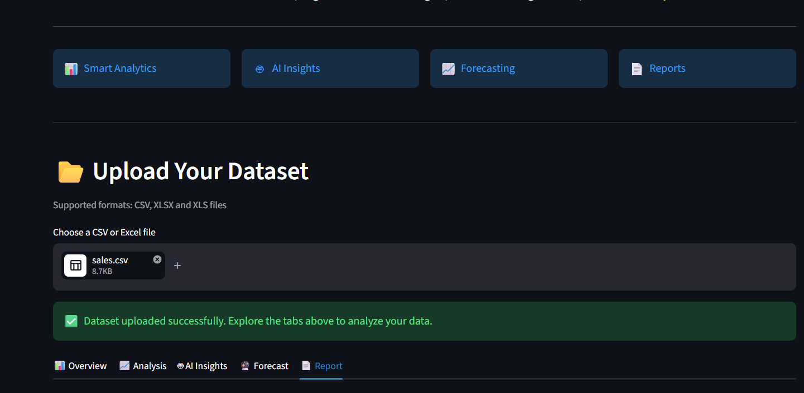

# 📊 DataSage AI

### AI-Powered Business Intelligence Platform

DataSage AI is an intelligent Business Intelligence platform that transforms raw datasets into meaningful insights using Artificial Intelligence and Machine Learning.

The application automatically cleans datasets, detects important business metrics, generates interactive visualizations, creates AI-powered executive summaries, forecasts future trends, and produces professional business reports.

---

# 🚀 Features

### 📂 Data Processing

- Upload CSV and Excel datasets
- Automatic data cleaning
- Missing value handling
- Duplicate removal
- Dataset profiling

---

### 🧠 Smart Analytics

- Descriptive Statistics
- Automatic Chart Recommendation
- Correlation Analysis
- Heatmap Generation
- Dataset Health Detection

---

### 🤖 AI Features

- AI Executive Summary
- Business Recommendations
- AI Chart Explanation
- AI Forecast Explanation
- Natural Language Dataset Understanding

---

### 📈 Machine Learning

- Automatic Forecast Detection
- Linear Regression Forecasting
- Interactive Forecast Dashboard
- Forecast KPIs

---

### 📄 Professional Reports

- PDF Report Generation
- AI Executive Report
- Forecast Summary
- Business Recommendations

---

# 🏗 Project Architecture

```
User Upload
      │
      ▼
Data Cleaning
      │
      ▼
Dataset Detection
      │
      ▼
Semantic Detection
      │
      ▼
Smart Analytics
      │
      ▼
OpenAI Insights
      │
      ▼
Machine Learning Forecast
      │
      ▼
Professional PDF Report
```

---

# 📂 Folder Structure

```text
DataSage-AI/

├── analysis/
├── assets/
├── llm/
├── report/
├── ui/
├── utils/

├── app.py
├── requirements.txt
├── README.md
└── .env
```

---

# 🛠 Tech Stack

| Category | Technology |
|----------|------------|
| Language | Python |
| Framework | Streamlit |
| AI | OpenAI GPT-5 |
| ML | Scikit-Learn |
| Data | Pandas |
| Visualization | Plotly |
| PDF | ReportLab |

---

# ⚙ Installation

Clone the repository

```bash
git clone https://github.com/YOUR_USERNAME/DataSage-AI.git
```

Move into the project folder

```bash
cd DataSage-AI
```

Install dependencies

```bash
pip install -r requirements.txt
```

Create a `.env` file

```env
OPENAI_API_KEY=your_api_key
```

Run the application

```bash
streamlit run app.py
```

---

# 💻 Usage

1. Upload a CSV or Excel dataset.
2. Explore the Overview dashboard.
3. Analyze smart visualizations.
4. Generate AI insights.
5. Forecast future trends.
6. Download the professional PDF report.

---

# 🔮 Future Enhancements

- Multiple ML forecasting models
- Time-series forecasting
- User authentication
- Dashboard sharing
- Database integration
- Cloud deployment
- Multi-language AI reports

---

# 📸 Screenshots

## Home



---

## Overview


---

## Analysis


---

## AI Insights


---

## Forecast


---

## Report


# 👨‍💻 Author

**Aditya Konwar**

Electronics and Communication Engineering

SRM Institute of Science and Technology

GitHub: https://github.com/AdityaKonwar2003

---

# ⭐ If you like this project

Give this repository a ⭐ on GitHub.
